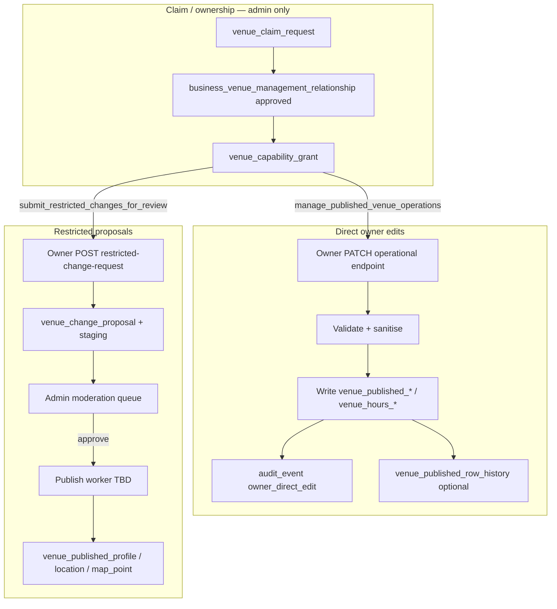

# Owner edit policy — Direct edits vs restricted proposals

## Purpose

Define the **Stage 4** product and technical model for owner venue editing after the policy reframe:

```text
Verified owner → direct edit of operational listing fields (no per-field admin review)
Restricted identity/location fields → proposal/staging → admin review → publish
Claim/ownership → separate authority workflow (not self-approved)
```

This document supersedes the Phase A assumption that **every** `core_details` field requires admin review before appearing publicly.

## Current stage

**Stage 4.1 — backend direct-edit implemented** for descriptions and hours (`PATCH operational-profile`, `PATCH hours`). Stage 4.2 (frontend split) is next. Legacy `POST .../proposals` remains for compatibility.

## Decisions

### 1. Which fields are direct-edit?

Verified owners with `manage_published_venue_operations` may PATCH these families; backend validates, sanitises, writes **published** tables via Django service role, and appends audit rows.

| Family | Fields | Published table(s) | MVP phase |
|--------|--------|-------------------|-----------|
| **Descriptions** | `short_description`, `long_description` | `venue_published_descriptive_copy` | 4.1 |
| **Hours** | `regular_hours_json`, `exceptions_json`, `uncertainty_level`, `notes` | `venue_hours_regular`, `venue_hours_exception`, `venue_hours_uncertainty` | 4.1 |
| **Contact** | `phone`, `email`, `website` | `venue_published_contact` *(migration required)* | 4.3+ |
| **Features / attributes** | boolean / enum values by `attribute_definition_id` | `venue_published_attribute_value` | Stage 7 |
| **Meal specials** | structured specials (`meal_special`, etc.) | `venue_published_structured_special` + validity/eligibility satellites | Stage 5 |
| **Tap list / drinks** | tap offerings, beverage links | `venue_published_tap_offering` + validity/eligibility | Stage 6 |
| **Recurring activities** | recurring offer patterns | `venue_published_special_recurring_pattern` | Later |
| **Events / one-off promos** | one-off promotions | `venue_published_special_one_off` | Later |
| **Menu links / uploads** | TBD | TBD | Later |
| **Photos / media** | image assets | TBD + moderation queue | Later |

**Never direct-edit (admin / import only):**

- `discovery_eligibility_status`, `operational_status` on `venue_published_profile` (major listing status)
- `slug` (derived on restricted name change approval)
- `google_place_id` (forbidden everywhere in owner APIs)

### 2. Which fields remain proposal/review?

Restricted changes use the **existing** proposal/staging stack (`venue_change_proposal`, `venue_proposal_staging_*`, `proposal_review`). Owners need `submit_restricted_changes_for_review` (in addition to approved relationship).

| Family | Fields | Staging table(s) | Target family |
|--------|--------|------------------|---------------|
| **Identity / profile** | `display_name` | `venue_proposal_staging_profile` (`proposed_display_name`) | `profile` |
| **Location** | `address_line_1`, `address_line_2`, `postal_code`, `country_code` | `venue_proposal_staging_location` | `geo` |
| **Locality / map** | `locality_id`, `latitude`, `longitude` | `venue_proposal_staging_location` | `geo` |

**Authority (not proposal intake):**

| Concern | Mechanism |
|---------|-----------|
| Venue claim legitimacy | `venue_claim_request` → admin → `business_venue_management_relationship` |
| Business ↔ venue management | `business_venue_management_relationship.relationship_lifecycle` (admin only) |
| Capability grants | `venue_capability_grant` (admin only) |
| ABN / business identity | `business` entity — out of owner self-service scope for MVP |

**Contact (when schema lands):** direct-edit by default; optional future flag for “suspicious contact change” moderation — not MVP.

### 3. Does Step 1 (Pub details) split?

**Yes.** Step 1 becomes two UI zones on `/owner/venues/:venueId/basics`:

| Zone | Fields | Primary action |
|------|--------|----------------|
| **Operational details** | Short/long description, opening hours; contact when schema exists | **Save changes** → direct PATCH |
| **Identity & location** | Display name, address, locality, map coordinates | **Request change** → restricted proposal POST |

`owner_confirms_management` moves to the **first restricted change request** (or first direct save if no restricted pending), not a global “submit everything” gate.

Completeness (`required_basics_complete`) reads **published** truth only — not staged operational drafts.

### 4. UI: Save vs Request change?

**Yes.**

| Action | Applies to | Copy |
|--------|------------|------|
| **Save changes** | Operational zone | “Your updates are live on your public listing.” |
| **Request change** | Restricted zone | “Some details, like your venue name and address, need approval before changing.” |

Operational fields are editable while a restricted proposal is `in_review` (independent workflows). Restricted fields show read-only values + pending banner when an open restricted proposal exists.

Remove hub/form copy: “All changes are reviewed before they appear publicly.” Replace with split messaging above.

### 5. Which Phase A endpoints are kept?

| Endpoint | Stage 4 disposition |
|----------|---------------------|
| `GET /api/v1/owner/venues` | **Keep** — adjust `onboarding_status` / `pending_proposal_count` to count **restricted** proposals only |
| `GET /api/v1/owner/venues/{venue_id}` | **Keep** — add `edit_policy` block; shrink `draft` to restricted-only; remove operational fields from `core_details_payload` over time |
| `POST /api/v1/owner/venues/{venue_id}/proposals` | **Deprecate for operational fields** — narrow to `section: "restricted_identity"` (alias path below) |

### 6. Which new direct-update endpoints?

**Recommended (minimal surface):**

| Method | Path | Body families | Notes |
|--------|------|---------------|-------|
| `PATCH` | `/api/v1/owner/venues/{venue_id}/operational-profile` | descriptions (+ contact when migrated) | Upsert `venue_published_descriptive_copy` |
| `PATCH` | `/api/v1/owner/venues/{venue_id}/hours` | opening hours bundle | Replace rows in `venue_hours_*` transactionally |
| `PATCH` | `/api/v1/owner/venues/{venue_id}/attributes` | feature toggles | Stage 7 |
| `PUT` | `/api/v1/owner/venues/{venue_id}/specials` | meal specials list | Stage 5 — replace-set semantics |
| `PUT` | `/api/v1/owner/venues/{venue_id}/tap-list` | tap offerings | Stage 6 |

**Restricted:**

| Method | Path | Replaces |
|--------|------|----------|
| `POST` | `/api/v1/owner/venues/{venue_id}/restricted-change-requests` | Operational subset of old `POST .../proposals` |

Keep `POST .../proposals` as a **compatibility shim** through Stage 4.2 (logs deprecation warning if operational fields present); remove in Stage 4.3.

**Guards (all write routes):**

1. `require_owner_portal_auth`
2. `assert_owner_manages_venue` — `relationship_lifecycle = approved`
3. Direct routes: require `manage_published_venue_operations` grant
4. Restricted routes: require `submit_restricted_changes_for_review` grant

### 7. Which published tables can backend update safely?

Django uses the **service role** connection (bypasses RLS per `0017_rls_public_truth_reads.sql`). Safe after permission checks:

| Table | Direct owner write | Preconditions |
|-------|-------------------|---------------|
| `venue_published_descriptive_copy` | ✅ | Approved relationship + capability |
| `venue_hours_regular` | ✅ | Same; delete+insert per venue |
| `venue_hours_exception` | ✅ | Same |
| `venue_hours_uncertainty` | ✅ | Upsert per venue |
| `venue_published_attribute_value` | ✅ | Valid `attribute_definition_id` from reference |
| `venue_published_structured_special` (+ satellites) | ✅ | Valid structured_kind + taxonomy |
| `venue_published_tap_offering` (+ satellites) | ✅ | Valid `beverage_product_id` |
| `venue_published_contact` | ✅ after migration | Validation only |
| `venue_published_profile` | ❌ owner direct | Restricted proposal + admin publish |
| `venue_published_location` | ❌ | Restricted |
| `venue_published_map_point` | ❌ | Restricted |

**Do not delete** staging or proposal tables; repurpose for restricted + future moderation.

### 8. Audit trail for direct updates

Each successful direct PATCH writes:

1. **`audit_event`** row:
   - `actor_type = 'owner'`
   - `actor_owner_account_id = <owner>`
   - `entity_table = '<published_table>'` (primary table touched)
   - `entity_id = venue_id`
   - `action = 'owner_direct_edit'`
   - `detail` JSON: `{ "field_family": "hours|descriptions|...", "changed_fields": [...], "before": {bounded snapshot}, "after": {bounded snapshot}, "channel": "owner_portal" }`

2. **`venue_published_row_history`** — **deferred to Stage 4.1b** (not written in 4.1; `audit_event` only)

Bounded snapshots in `audit_event.detail`: before/after JSON; omit secrets; never include `google_place_id`.

### 9. Should direct updates create `audit_event` rows?

**Yes — always.** This is the MVP audit trail. `venue_published_row_history` is strongly recommended for rollback but can follow in 4.1b if timeboxed.

### 10. Rollback (initial)

| Scope | MVP approach |
|-------|--------------|
| **Owner-facing** | None — owners edit forward; show last-saved published state on reload |
| **Admin** | Read `venue_published_row_history` + `audit_event`; manual restore via internal tooling (deferred UI) |
| **Automated** | Deferred publish worker handles restricted approvals; direct edits use history snapshots |

Do not implement owner self-rollback in MVP.

### 11. How admin sees restricted change requests

**No new queue table.** Existing moderation APIs (`/api/v1/internal/moderation/*`) already list `venue_change_proposal` rows.

| Filter / signal | Implementation |
|-----------------|----------------|
| Owner restricted only | `actor_type = 'owner'`, `channel = 'owner_portal'`, targets ⊆ `{profile, geo}` |
| Distinguish legacy bundles | `proposal_kind = 'field_family'` + staging profile **without** hours row, or explicit `detail.proposal_scope = 'restricted_identity'` in audit on create |
| Queue label | Moderation read joins `venue_proposal_staging_profile` + `_location` for proposed name/address |

Admin approve → existing `decide_moderation_item` → **publish worker** applies staging → published profile/location/map (worker still TBD; same as pre-Stage-4 plan).

Direct owner edits **do not** appear in moderation queue.

### 12. Minimal direct-edit MVP (before more onboarding pages)

**Stage 4.1 backend:**

- `PATCH .../operational-profile` (descriptions)
- `PATCH .../hours`
- `audit_event` on each write
- Enforce `manage_published_venue_operations`

**Stage 4.2 frontend:**

- Split Step 1 form zones
- Wire Save / Request change
- Deprecate operational use of `POST .../proposals`

**Stage 4.3 (optional hardening):**

- `venue_published_row_history` snapshots
- Remove proposal shim for operational fields
- Contact schema migration + PATCH extension

Only after 4.1/4.2 should Stages 5–7 build **direct-edit** pages (not proposal-first).

---

## Target architecture



## Assumptions

- “Verified owner” means `business_venue_management_relationship.relationship_lifecycle = 'approved'` **and** active capability grants (enforce grants in 4.1; Phase A only logged warnings).
- Unverified owners (pending claim, no relationship) cannot call any owner write APIs.
- Publish worker for **restricted** approvals remains unimplemented; direct edits go live immediately on PATCH success.
- Consumer correction intake unchanged.
- No schema deletion of proposal/staging tables.

## Open questions

| # | Question | Default if unresolved |
|---|----------|----------------------|
| 1 | Should first-time venues with empty published descriptions require admin review once? | No — direct edit allowed; completeness gate only |
| 2 | Enforce `manage_published_venue_operations` strictly or fallback to relationship-only? | **Strict** in 4.1 |
| 3 | Single `PATCH /operational-profile` vs separate descriptions/contact? | Single endpoint; contact fields optional when `supported: true` |
| 4 | Slug regeneration on restricted name approval — automatic or admin? | Admin/publish worker derives slug; owner never sets slug |
| 5 | Photo moderation queue separate from restricted identity? | Yes — later stage |

## Dependencies

- Existing: `owner_venue_service.py`, `venue_capability_grant`, published tables, `audit_event`
- `OWNER_VENUE_API_CONTRACT.md` (updated DTOs)
- `STAGING_REVIEW_PUBLISH_AUDIT.md` (restricted-only repositioning)
- Future: contact migration, publish worker for restricted approvals, admin history restore UI

## Next downstream use

| Stage | Work |
|-------|------|
| **4.1** | ✅ Backend `PATCH operational-profile`, `PATCH hours`, audit writes, grant enforcement |
| **4.2** | Frontend Step 1 split; `POST restricted-change-requests` client |
| **4.3** | History snapshots; contact schema; remove operational proposal shim |
| **5–7** | Direct-edit pages for specials, taps, features |
| **Admin** | Restricted publish worker; moderation filter polish |

## Superseded material

The following docs/sections assumed **review-all** and are superseded by this policy (sections marked “Superseded” in each file):

- `OWNER_VENUE_API_CONTRACT.md` — “Direct publish: none”, all fields “review required”
- `DATA_CAPTURE_MODEL.md` — “No direct publish from owner APIs”
- `UX_FLOW.md` — single “Submit for review” for Step 1
- `AGENT_RULES.md` — “no direct published-truth writes”
- `STAGING_REVIEW_PUBLISH_AUDIT.md` — owner MVP lifecycle treating hours/descriptions as staged-only

Phase A `POST .../proposals` **remains** until Stage 4.2/4.3 migrate frontend and narrow shim.

---

## Stage 4.1 implementation notes

| Item | Status |
|------|--------|
| `PATCH .../operational-profile` | ✅ `owner_venue_service.patch_owner_operational_profile` |
| `PATCH .../hours` | ✅ `owner_venue_service.patch_owner_venue_hours` |
| Capability `manage_published_venue_operations` | ✅ Enforced; `403` if missing |
| `audit_event` (`owner_direct_edit`) | ✅ Before/after in `detail` JSON |
| `venue_published_row_history` | Deferred 4.1b |
| `POST .../restricted-change-requests` | Planned 4.2 backend |
| Hour `exceptions_json` non-empty | Rejected `400` until mapping defined |

**Restricted migration path:** Add `POST .../restricted-change-requests` in 4.2; narrow legacy `POST .../proposals` to reject operational-only payloads; frontend uses restricted POST for name/address zone.
