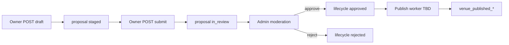

# Staging / review / publish model audit

## Purpose

Audit existing proposal, staging, moderation, and publish tables; recommend MVP simplification path without destructive schema changes in Stage 1.

## Current stage

**Stage 1 — complete.** Recommendation locked for Phase A implementation.

## Decisions

**Recommendation:** **Create a lightweight owner proposal endpoint over existing tables** — do not add a new parallel table; do not delete or consolidate tables in Stage 1.

| Option | Verdict |
|--------|---------|
| Keep model as-is structurally | ✅ Yes |
| Simplify by usage (one bundle intake) | ✅ Yes — application layer only |
| Consolidate tables later | Optional future migration; not Phase A |
| New simpler table | ❌ Rejected — duplicates `venue_change_proposal` |
| Bypass staging | ❌ Rejected — violates published-truth RLS |

## Assumptions

- Publish/apply to `venue_published_*` will be a separate backend workstream after moderation approve.
- Owner portal uses Django API only for writes (not Supabase direct insert), same as consumer submissions.

## Open questions

- Should `decide_moderation_item(approve)` automatically enqueue publish job?
- Single `core_details` proposal vs three consumer-style proposals per save — **decided:** one proposal, multiple targets for owner MVP.

## Dependencies

- Migrations `0007`, `0008`, `0009`, `0012`, `0019`, `0020`
- `moderation_write_service.py`, `submission_intake_service.py`

## Next downstream use

Backend owner intake implementation; future publish worker design.

---

## 1. Which tables stage owner-submitted venue changes?

| Table | Owner role |
|-------|------------|
| `venue_change_proposal` | Header: `actor_type='owner'`, `actor_owner_account_id`, `channel='owner_portal'` |
| `venue_proposal_target` | Families: `profile`, `geo`, `hours` (Phase A bundle) |
| `venue_proposal_staging_profile` | Name, descriptions (profile fields) |
| `venue_proposal_staging_location` | Address, locality, coordinates |
| `venue_proposal_staging_hours` | JSON hours + uncertainty + notes |
| `venue_proposal_staging_attribute` | Phase B features only |

**Not used for owner MVP:** `raw_venue_intake_record`, `consumer_submission_extension`, `consumer_workflow_submission`.

**RLS:** `0019_rls_owner_business_authority.sql` — owner authenticated policies on proposal + staging (Django bypasses via app DB role for intake, same as consumer).

---

## 2. Which tables stage consumer corrections?

Same core stack:

| Table | Consumer-specific |
|-------|-------------------|
| `venue_change_proposal` | `actor_type='consumer'`, `channel='app_consumer'` |
| `venue_proposal_target` + staging_* | Per-domain single family per POST |
| `consumer_submission_extension` | Optional metadata on proposal (`0012`) |

**Implementation:** `backend/src/apps/submissions/services/submission_intake_service.py` — one domain per request (`profile`, `location`, `attributes`, `hours`).

---

## 3. Which tables record moderation review?

| Table | Purpose |
|-------|---------|
| `proposal_review` | Admin decision rows (`review_outcome`, `reviewed_at`, `reviewer_admin_account_id`) |
| `venue_change_proposal.lifecycle_status` | Updated to `approved` or `rejected` on decide |
| `audit_event` | `moderation_decision`, `internal_note` actions |

**Implementation:** `backend/src/apps/internal_tools/services/moderation_write_service.py` — `decide_moderation_item`, `add_moderation_note`.

**Queue read:** `moderation_read_service.py` — joins staging profile for labels.

---

## 4. Which tables apply approved changes to published venue tables?

| Table | Applies live truth? |
|-------|---------------------|
| `venue_publish_event` | Lineage only — **insert not implemented in backend** |
| `venue_published_row_history` | Snapshots on publish — **not implemented** |
| `venue_published_profile` | **Target** — no automated writer found |
| `venue_published_location` | **Target** — no automated writer |
| `venue_hours_*` | **Target** — no automated writer |
| `venue_published_descriptive_copy` | **Target** — no automated writer |

**Confirmed:** `backend/docs/API_ENDPOINT_OVERVIEW.md` — moderation approve does **not** write published rows or `venue_publish_event`.

**Grep:** no `INSERT INTO public.venue_publish_event` in `backend/src/`.

---

## 5. Is publish/apply implemented?

| Step | Status |
|------|--------|
| Owner/consumer intake → staging | ✅ Consumer yes; owner **pending** |
| Queue / review | ✅ Admin moderation |
| Approve → lifecycle | ✅ |
| Approve → published truth | ❌ **Not implemented** |
| Publish event lineage | ❌ **Not implemented** |

**Implication for owner UX:** Copy must say changes are **reviewed**; “live listing” updates only after future publish worker (or manual admin ops).

---

## 6. Duplicate or overlapping tables?

| Observation | Assessment |
|-------------|------------|
| `venue_proposal_staging_profile` holds `proposed_short_description` / `proposed_long_description` while target family `descriptive_copy` exists | **Overlap by design** — staging profile comment says profile + descriptive copy candidates; consumer uses `profile` domain only. Owner MVP: use **profile staging only**, skip separate `descriptive_copy` target. |
| `proposal_review` vs `venue_authority_decision` | **Not duplicate** — public-truth review vs claim/verification authority (`0015`) |
| `consumer_submission_extension` vs proposal header | Extension is optional metadata — owners skip |
| `raw_venue_intake_record` vs proposals | Intake is import/scrape path — owners skip for MVP |

**Verdict:** No table removal recommended pre-MVP. Reduce **perceived** complexity by bundling owner writes into one service function.

---

## 7. Can MVP use a simpler model?

### What is overbuilt for MVP?

- Six target families and four staging tables — **appropriate** for long-term; heavy for a single form.
- `venue_publish_event` + `venue_published_row_history` — **ahead of implementation**.
- `consumer_submission_extension` — irrelevant to owners.

### MVP simplification (application layer)

```text
Owner POST core_details
  → one venue_change_proposal
  → three venue_proposal_target rows (profile, geo, hours)
  → upsert three staging rows
  → optional: reuse open staged proposal for draft saves
```

**Do not** simplify DB schema in Stage 1.

### Later consolidation candidates (planning only)

| Future change | Risk |
|---------------|------|
| Merge descriptive copy into profile staging only (drop `descriptive_copy` target enum usage) | Low — doc + intake alignment |
| Add `owner_submission_extension` for contact-person metadata | Low — mirrors consumer |
| Add `venue_proposal_staging_contact` + `venue_published_contact` | Medium — migration required |
| Publish worker on approve | High value — unblocks “go live” |

---

## 8. Lifecycle flow (owner MVP)



---

## 9. Comparison: consumer vs owner Phase A

| Aspect | Consumer | Owner Phase A |
|--------|----------|---------------|
| Endpoint | `POST /submissions/corrections` | `POST /owner/venues/{id}/proposals` |
| Domains per request | 1 | 3 (bundled as `core_details`) |
| Response | Ack only, no `proposal_id` | **Return `proposal_id`** for UX |
| `submitted_at` | Set on create | Set only on `intent=submit` |
| Extension table | Yes | No |

**Recommendation:** Owner API should return `proposal_id` (improvement over consumer ack) — already in `OWNER_VENUE_API_CONTRACT.md`.

---

## 10. Later migration / planning note (not executed)

When contact fields are added:

```text
Migration: venue_published_contact + venue_proposal_staging_contact
Target family: contact (extend venue_proposal_target check)
Publish worker maps staging → published for each family
```

File planning reference only under `docs/owner-venue-onboarding/` — no SQL in Stage 1.
