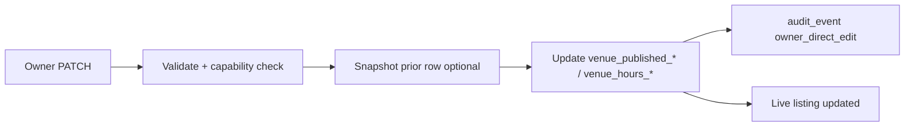
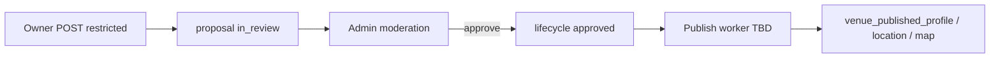

# Staging / review / publish model audit

## Purpose

Audit proposal, staging, moderation, and publish tables; define how they fit the **Stage 4** model (restricted changes only for owners; direct operational writes bypass staging).

## Current stage

**Stage 4.1 — direct edits live.** Staging stack retained for **restricted identity/location** owner requests and all consumer corrections. Operational owner edits (descriptions, hours) write published tables directly with `audit_event`.

## Decisions

| Topic | Decision |
|-------|----------|
| Keep staging tables structurally | ✅ Yes — do not delete |
| Owner operational edits | **Bypass staging** — PATCH → published + `audit_event` |
| Owner restricted edits | **Use staging** — `profile` + `geo` targets only |
| Consumer corrections | Unchanged — per-domain proposals |
| Publish worker | Still required for **restricted** approvals; not for direct edits |
| `venue_publish_event` / row history | Direct edits: optional snapshot in 4.1b; restricted: full lineage on publish worker |

### Superseded (pre–Stage 4)

> ~~Owner POST core_details → three targets (profile, geo, hours) for every save~~ — hours/descriptions removed from owner proposal bundle.

## Assumptions

- Django service role bypasses RLS for published writes (`0017`)
- Moderation queue unchanged structurally; filters owner restricted proposals by target families
- `decide_moderation_item(approve)` still does not auto-publish (worker TBD)

## Open questions

- Add `proposal_scope` metadata column vs infer from staging row presence (default: infer — no migration in 4.1)
- Should approved restricted proposals auto-enqueue publish job? (default: yes when worker lands)

## Dependencies

- Migrations `0007`, `0008`, `0009`, `0012`, `0019`, `0020`
- `OWNER_EDIT_POLICY.md`
- `moderation_write_service.py`, `submission_intake_service.py`

## Next downstream use

Stage 4.1 restricted POST mapper; publish worker design for `profile`+`geo` only.

---

## 1. Tables for owner **restricted** changes

| Table | Owner restricted role |
|-------|----------------------|
| `venue_change_proposal` | Header: `actor_type='owner'`, `channel='owner_portal'` |
| `venue_proposal_target` | Families: **`profile`, `geo` only** |
| `venue_proposal_staging_profile` | Proposed `display_name` only (not descriptions in restricted flow) |
| `venue_proposal_staging_location` | Address, locality, coordinates |
| `venue_proposal_staging_hours` | **Not used** for owner restricted proposals |
| `proposal_review` | Admin decision |

## 2. Tables for owner **direct** operational changes

| Table | Role |
|-------|------|
| `venue_published_descriptive_copy` | Live descriptions |
| `venue_hours_regular` / `_exception` / `_uncertainty` | Live hours |
| `venue_published_attribute_value` | Features (Stage 7) |
| `venue_published_structured_special` (+ satellites) | Specials (Stage 5) |
| `venue_published_tap_offering` (+ satellites) | Taps (Stage 6) |
| `audit_event` | `action = 'owner_direct_edit'` |
| `venue_published_row_history` | Pre-change snapshot (optional 4.1b) |

**Not used for owner operational MVP:** `venue_change_proposal` staging path.

## 3. Consumer corrections (unchanged)

Same core stack as before — `submission_intake_service.py`, one domain per POST.

## 4. Moderation review (unchanged tables)

| Table | Purpose |
|-------|---------|
| `proposal_review` | Admin decision |
| `venue_change_proposal.lifecycle_status` | `approved` / `rejected` / etc. |
| `audit_event` | `moderation_decision`, `internal_note` |

**Queue content after Stage 4:** Owner items are **restricted only** (no hours/description bundles). Legacy in_review `core_details` bundles may exist until migrated/closed.

## 5. Publish / apply status

| Path | Staging | Review | Apply to published |
|------|---------|--------|-------------------|
| Owner direct PATCH | ❌ | ❌ | ✅ immediate (4.1) |
| Owner restricted POST | ✅ | ✅ | ❌ worker TBD |
| Consumer correction | ✅ | ✅ | ❌ worker TBD |
| Admin tool | varies | varies | manual / TBD |

**Confirmed:** moderation approve does **not** yet write `venue_published_*` for proposals.

## 6. Duplicate or overlapping tables?

| Observation | Assessment |
|-------------|------------|
| Profile staging holds descriptions historically | **Split usage:** descriptions → direct published; `proposed_display_name` → restricted staging only |
| `proposal_review` vs `venue_authority_decision` | **Not duplicate** — public-truth vs claim authority |
| `audit_event` vs `venue_published_row_history` | Complementary — audit is event log; history is rollback snapshot |

**Verdict:** No table removal. Reduce complexity by **usage** split, not schema consolidation.

## 7. Lifecycle flows

### Owner direct edit



### Owner restricted change



## 8. Comparison: consumer vs owner (post–Stage 4)

| Aspect | Consumer | Owner operational | Owner restricted |
|--------|----------|-------------------|------------------|
| Endpoint | `POST /submissions/corrections` | `PATCH /owner/venues/{id}/...` | `POST .../restricted-change-requests` |
| Staging | Yes | No | Yes |
| Admin review | Yes | No | Yes |
| Live on save | No | **Yes** | No |

## 9. Later migration notes (not executed in Stage 4)

```text
Optional: venue_published_contact + extend PATCH operational-profile
Optional: proposal_scope enum on venue_change_proposal for queue filtering
Publish worker: map restricted staging profile/geo → published + venue_publish_event
```

No SQL in Stage 4 planning.

---

## 10. Review/publish table classification (Stage 4.1 audit)

| Table | Classification | Reason |
|-------|----------------|--------|
| `venue_change_proposal` | **Keep / repurpose** | Restricted owner changes + consumer corrections |
| `venue_proposal_target` | **Keep / repurpose** | `profile` + `geo` for restricted; consumer domains |
| `venue_proposal_staging_profile` | **Keep / repurpose** | `proposed_display_name` for restricted; not descriptions in 4.1 |
| `venue_proposal_staging_location` | **Keep / repurpose** | Restricted address/locality/map |
| `venue_proposal_staging_hours` | **Keep** | Legacy Phase A bundles; consumer hours proposals |
| `venue_proposal_staging_attribute` | **Keep** | Future restricted moderation / consumer attributes |
| `proposal_review` | **Keep** | Admin moderation decisions |
| `venue_publish_event` | **Keep** | Publish lineage when worker lands |
| `venue_published_row_history` | **Keep** | Rollback snapshots (4.1b+) |
| `consumer_submission_extension` | **Keep** | Consumer submission metadata |
| `raw_venue_intake_record` | **Keep** | Import/scrape intake path |

**No tables marked for deletion in Stage 4.1.**
