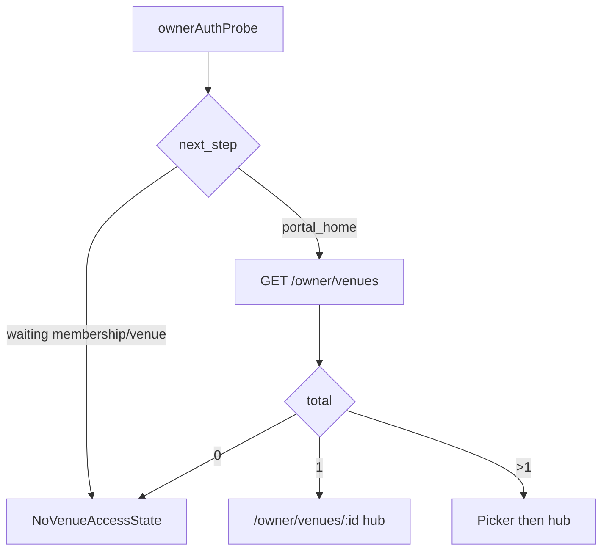

# UX flow — Owner venue onboarding

## Purpose

Owner-facing navigation and screen contracts for Stages 2–3, aligned with frozen API DTOs.

## Current stage

**Stage 1 complete.** Routes and states defined for implementation.

## Decisions

| Topic | Decision |
|-------|----------|
| Single venue | When list `meta.default_venue_id` set → redirect or pre-select `/owner/venues/{id}` |
| Multi venue | Picker on `/owner` before venue hub |
| Hub replaces placeholder | When `auth-probe` `portal_home` and list non-empty |
| Step 1 route | `/owner/venues/:venueId/basics` |
| No venue API | Keep `NoVenueAccessState`; no claim form in Phase A |
| Save UX | `intent: draft` on save; `intent: submit` on “Submit for review” |

## Assumptions

- `PortalShell` + `portalBrand` unchanged
- Owner never sees Google Place ID or admin tools

## Open questions

- Public preview link before publish (defer)

## Dependencies

- `OWNER_VENUE_API_CONTRACT.md`
- `OwnerHomePlaceholder` / `NoVenueAccessState` components

## Next downstream use

`stages/STAGE_02_owner_home_entry.md`, `stages/STAGE_03_core_pub_info.md`

---

## Entry states



## Stage 2 — Owner home entry

### Routes

| Path | Component (proposed) |
|------|----------------------|
| `/owner` | `OwnerPortalEntry` — list or redirect |
| `/owner/venues/:venueId` | `OwnerVenueHub` — checklist |

### API

- `GET /api/v1/owner/venues`

### Loading / error / empty

| State | UX |
|-------|-----|
| Loading | “Loading your venues…” |
| Error | `ErrorBanner` + retry |
| `venues: []` + `portal_home` | Should not happen often; show venue wait copy + support link |
| `venues: []` + waiting probe | Do not call list; show existing empty state |

### Copy

- Hub headline: “Complete your listing”
- Subhead: “Confirm the basics now. Add more detail whenever you can.”
- Optional row: “Changes are reviewed before they appear publicly.”

### Checklist rows

| key | Label | Required | Phase A |
|-----|-------|----------|---------|
| `core_details` | Pub details | Yes | Active |
| `events` | Events | No | Deferred label |
| `meal_specials` | Meal specials | No | Disabled |
| `tap_list` | Tap list | No | Disabled |
| `features` | Features | No | Disabled |
| `photos` | Photos | No | Deferred |

Use `completeness.sections` from detail GET when on venue hub (Stage 2 may use list item flags only).

---

## Stage 3 — Core pub info form

### Route

`/owner/venues/:venueId/basics`

### API

- `GET /api/v1/owner/venues/:venueId` — hydrate form from `published` + `draft.payload_preview`
- `POST /api/v1/owner/venues/:venueId/proposals` — save/submit
- `GET /api/v1/reference/localities` — locality typeahead/select

### Form fields (Phase A visible)

- Display name
- Address line 1, line 2, postcode
- Locality (select)
- Short description (required); long description optional
- Opening hours (simple weekly grid → `regular_hours_json`)
- Checkbox: “I manage this venue” (`owner_confirms_management`) — required on submit

**Hidden until schema:** phone, email, website, contact person fields.

### Actions

| Button | API |
|--------|-----|
| Save progress | `intent: "draft"` |
| Submit for review | `intent: "submit"` + confirm management |

### States after submit

| `pending_review.lifecycle_status` | Message |
|----------------------------------|---------|
| `in_review` / staged with submitted_at | “Submitted — we’ll review your changes.” |
| `rejected` | “Please update and resubmit.” + link to form |

### Validation

Client-side mirrors server rules in `OWNER_VENUE_API_CONTRACT.md` (length, email format when added, etc.).

---

## Routing assumptions (`App.tsx`)

```text
/owner/* → OwnerRouteGuard
  index → OwnerPortalEntry
  venues/:venueId → OwnerVenueHub
  venues/:venueId/basics → OwnerVenueBasicsPage
```

No sidebar. Breadcrumb optional: “Back to checklist” only.
