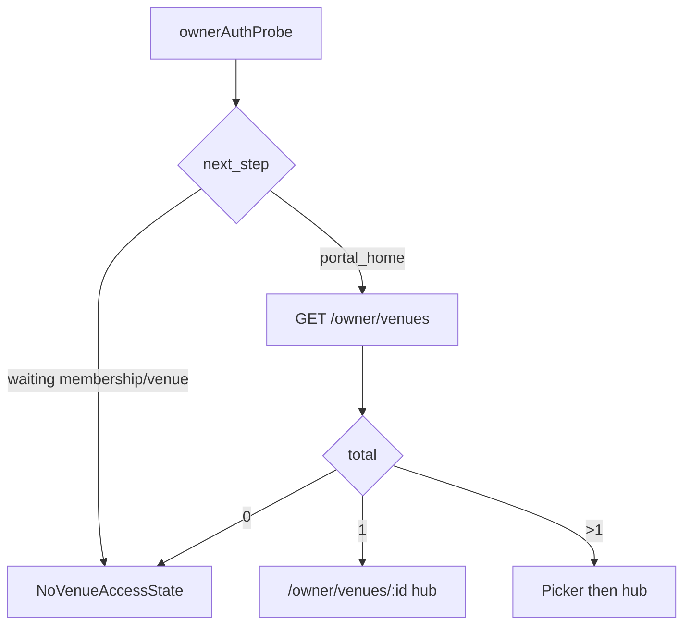

# UX flow — Owner venue onboarding

## Purpose

Owner-facing navigation and screen contracts aligned with `OWNER_EDIT_POLICY.md` — direct operational saves vs restricted change requests.

## Current stage

**Stage 4.2 complete.** Step 1 splits operational **Save changes** (PATCH) from restricted **Request change** (POST). Legacy single “Submit for review” flow removed from basics page.

## Decisions

| Topic | Decision |
|-------|----------|
| Single venue | `meta.default_venue_id` → redirect or pre-select `/owner/venues/{id}` |
| Multi venue | Picker on `/owner` before venue hub |
| Step 1 route | `/owner/venues/:venueId/basics` — **two zones** (operational + restricted) |
| Operational save | **Save changes** → PATCH APIs; live immediately |
| Restricted save | **Request change** → restricted proposal; pending until admin publish |
| No venue API | `NoVenueAccessState`; no claim form in MVP |
| Future sections | Mostly direct-edit pages (specials, taps, features) |

### Superseded (pre–Stage 4)

> ~~Save UX: `intent: draft` / `intent: submit` for all Step 1 fields~~ — operational fields use PATCH; restricted uses request workflow only.

## Assumptions

- `PortalShell` + `portalBrand` unchanged
- Owner never sees Google Place ID or admin tools
- Hub copy distinguishes “live updates” vs “pending name/address request”

## Open questions

- Public preview link before restricted approval (defer)
- Whether restricted fields show diff (old vs requested) in owner UI (nice-to-have; default: show requested values in form)

## Dependencies

- `OWNER_EDIT_POLICY.md`
- `OWNER_VENUE_API_CONTRACT.md`
- `OwnerHomePlaceholder` / `NoVenueAccessState`

## Next downstream use

Stage 5–7 direct-edit section pages.

---

## Entry states



## Owner home / hub (Stage 2 — adjust copy Stage 4.2)

### Routes

| Path | Component |
|------|-----------|
| `/owner` | `OwnerPortalEntry` |
| `/owner/venues/:venueId` | `OwnerVenueHub` |

### Hub copy (updated)

- Headline: “Complete your listing”
- Subhead: “Update your hours and description anytime. Name or address changes need our team to approve.”
- Checklist row `core_details`: status from **published** completeness
- Show badge when **restricted** proposal `in_review` (not for operational saves)

### Checklist rows

| key | Label | Required | Edit model |
|-----|-------|----------|------------|
| `core_details` | Pub details | Yes | Mixed (Step 1) |
| `meal_specials` | Meal specials | No | Direct (Stage 5) |
| `tap_list` | Tap list | No | Direct (Stage 6) |
| `features` | Features | No | Direct (Stage 7) |
| `events` | Events | No | Deferred |
| `photos` | Photos | No | Deferred + moderation |

---

## Stage 3 / 4.2 — Pub details form (split)

### Route

`/owner/venues/:venueId/basics`

### Layout

```text
┌─────────────────────────────────────────┐
│ Operational details                      │
│  Short description, long description     │
│  Opening hours grid + notes              │
│  Contact (when schema exists)            │
│  [ Save changes ]                        │
└─────────────────────────────────────────┘

┌─────────────────────────────────────────┐
│ Identity & location                      │
│  ℹ Some details need approval before     │
│    changing (name, address).             │
│  Display name, address, locality         │
│  Map coordinates (optional, advanced)    │
│  [ Request change ]                      │
└─────────────────────────────────────────┘
```

### API calls

| Zone | Load | Save |
|------|------|------|
| Operational | `GET .../venues/{id}` → `published.descriptions`, `published.hours` | `PATCH .../operational-profile`, `PATCH .../hours` |
| Restricted | `GET .../venues/{id}` → `published.profile`, `published.location` + `draft` restricted payload | `POST .../restricted-change-requests` |
| Locality picker | `GET /api/v1/reference/localities` | Restricted zone only |

### Actions

| Button | Scope | API | Success copy |
|--------|-------|-----|--------------|
| **Save changes** | Operational zone | PATCH endpoints | “Saved. These updates are now reflected on your listing.” |
| **Request change** | Restricted zone | POST restricted-change-requests | “Change request submitted. We'll review it before updating your listing.” |

### States

| Condition | UX |
|-----------|-----|
| Restricted `in_review` | Banner on restricted zone; fields read-only or show pending values |
| Restricted `rejected` | “Please update and request again.” |
| Operational save success | Green banner; no moderation pending |
| No `manage_published_venue_operations` | Operational zone disabled + support message (edge case) |

### `owner_confirms_management`

Required on **first restricted change request** (not on operational Save).

### Validation

- Operational: client mirrors PATCH contract validation
- Restricted: client mirrors restricted payload rules (name/address required on request)

---

## Future section pages (direct-edit pattern)

| Route | Page | Primary action |
|-------|------|----------------|
| `/owner/venues/:id/features` | Features | Save changes |
| `/owner/venues/:id/specials` | Meal specials | Save changes |
| `/owner/venues/:id/taps` | Tap list | Save changes |

No “Submit for review” on these pages unless a field is later reclassified as restricted.

---

## Routing (`App.tsx`)

```text
/owner/* → OwnerRouteGuard
  index → OwnerPortalEntry
  venues/:venueId → OwnerVenueHub
  venues/:venueId/basics → OwnerVenueBasicsPage
  venues/:venueId/features → (Stage 7)
  venues/:venueId/specials → (Stage 5)
  venues/:venueId/taps → (Stage 6)
```

No sidebar. Breadcrumb: “Back to checklist” only.
